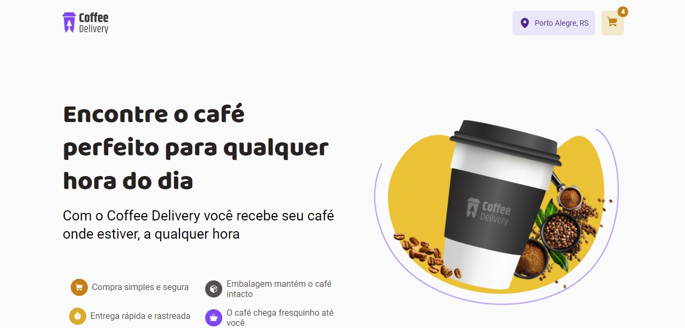

# Coffee Delivery

This project is a `online coffee shop`,  it's a front-end challenge provided by [Rocketseat](https://www.rocketseat.com.br) BootCamp Ignite.

Developed with `React`, `Typescript` and `Styled-Components`.

**React hooks used:**
- useContext
- useReducer
- useState
- useEffect

  

<h4 align=center>Developed by <a href="https://www.linkedin.com/in/guirdy/">Guilherme Leandro</a> 💻</h4>
